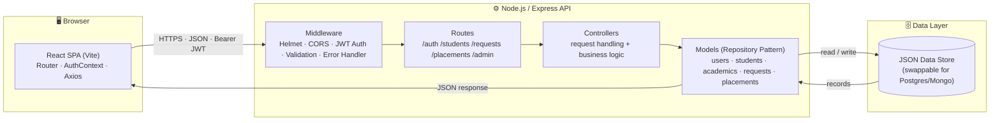

# Zen Stud — Student Portal

A full-stack **Student Portal** that lets students manage their personal &
academic records and submit change requests, while administrators review those
requests and look up student profiles.

This is a complete, production-style rewrite of the original static HTML
prototype, split into a clean **REST API backend** and a **modern React
frontend**.

---

## 🧭 Architecture



**Request lifecycle:** the React SPA attaches a JWT to each call → Express
middleware authenticates & validates → the matching route delegates to a
controller → the controller uses the model layer to read/write the data store →
a JSON response flows back to the client. Swapping the database later only
touches the **models** layer.

---

## ✨ Features

### Student
- Secure login (JWT + hashed passwords)
- Dashboard with profile summary
- View & edit **personal information**
- View **academic records** for each semester (1–8): CGPA, backlogs, marksheets
- Submit **change requests** for academic data
- Upload a **resume**
- View **placement drives** and consolidated **report**

### Admin
- Secure login
- Search students by email / roll number
- Review pending **change requests** and **accept / reject** them
- View any student's full report

---

## 🏗️ Tech Stack

| Layer      | Technology                                              |
| ---------- | ------------------------------------------------------- |
| Frontend   | React 18, Vite, React Router, Axios, plain modern CSS   |
| Backend    | Node.js, Express, JWT, bcryptjs, express-validator      |
| Storage    | File-based JSON store (zero native dependencies)        |
| Tooling    | Nodemon, ESLint, Concurrently                           |

> The data layer uses a small repository pattern over JSON files so the project
> runs anywhere with **no database setup and no native build tools**. Swapping
> in PostgreSQL/MongoDB later only requires changing the `models` layer.

---

## 📁 Project Structure

```
student-portal/
├── backend/                 # Express REST API
│   ├── src/
│   │   ├── config/          # env + data-store bootstrap
│   │   ├── data/            # JSON "database" files (generated by seed)
│   │   ├── controllers/     # request handlers
│   │   ├── middleware/      # auth, validation, errors
│   │   ├── models/          # data access (repository pattern)
│   │   ├── routes/          # route definitions
│   │   ├── utils/           # helpers (ApiError, tokens, logger…)
│   │   ├── seed.js          # demo data generator
│   │   ├── app.js           # express app
│   │   └── server.js        # entry point
│   └── package.json
│
├── frontend/                # React + Vite SPA
│   ├── src/
│   │   ├── api/             # axios client + endpoint wrappers
│   │   ├── components/      # reusable UI
│   │   ├── context/         # auth context
│   │   ├── pages/           # route pages (student + admin)
│   │   ├── styles/          # global styles + theme
│   │   ├── App.jsx
│   │   └── main.jsx
│   └── package.json
│
├── package.json             # root scripts (run both apps together)
└── README.md
```

---

## 🚀 Getting Started

### 1. Install dependencies

```bash
npm run install:all
```

### 2. Seed demo data

```bash
npm run seed
```

### 3. Run both apps (in separate terminals or together)

```bash
npm run dev
```

- API:      http://localhost:4000/api
- Frontend: http://localhost:5173

The Vite dev server proxies `/api` to the backend, so no CORS config is needed
in development.

---

## 🔑 Demo Accounts

| Role    | Email                  | Password    |
| ------- | ---------------------- | ----------- |
| Admin   | `admin@zenstud.edu`    | `Admin@123` |
| Student | `aisha@zenstud.edu`    | `Student@1` |
| Student | `rahul@zenstud.edu`    | `Student@1` |

---

## 📡 API Overview

| Method | Endpoint                          | Auth    | Description                       |
| ------ | --------------------------------- | ------- | --------------------------------- |
| POST   | `/api/auth/login`                 | —       | Login (student or admin)          |
| GET    | `/api/auth/me`                    | Any     | Current user                      |
| GET    | `/api/students/me`                | Student | Own profile + academics           |
| PUT    | `/api/students/me`                | Student | Update personal info              |
| GET    | `/api/students/me/academics`      | Student | All semesters                     |
| GET    | `/api/placements`                 | Any     | Placement drives                  |
| POST   | `/api/requests`                   | Student | Submit a change request           |
| GET    | `/api/requests`                   | Admin   | List requests                     |
| PATCH  | `/api/requests/:id`               | Admin   | Accept / reject a request         |
| GET    | `/api/admin/students`             | Admin   | Search students                   |
| GET    | `/api/admin/students/:id`         | Admin   | Student full report               |

---

## 📝 License

MIT — for educational/demo use.
